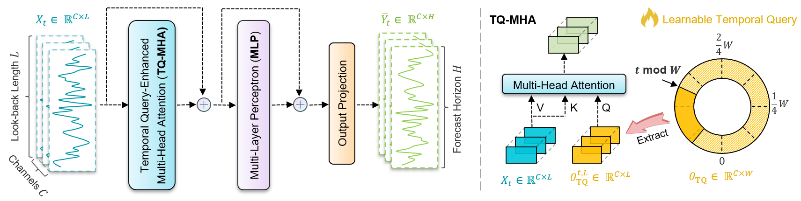
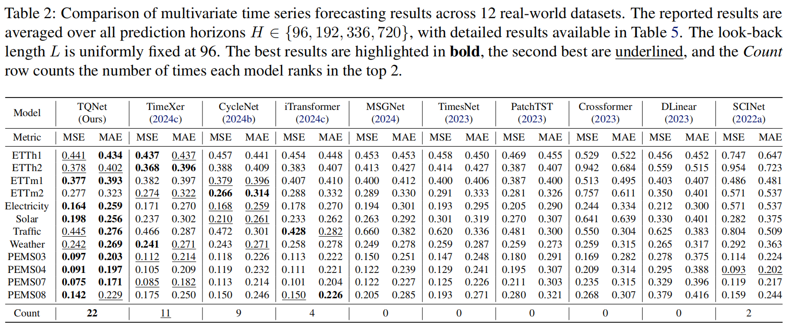
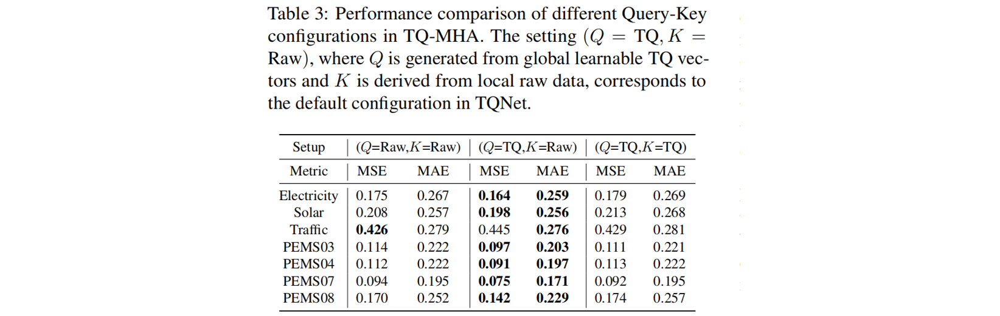
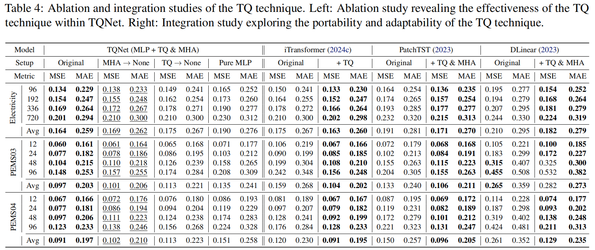
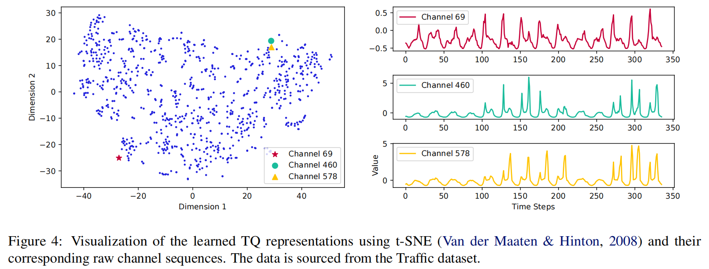
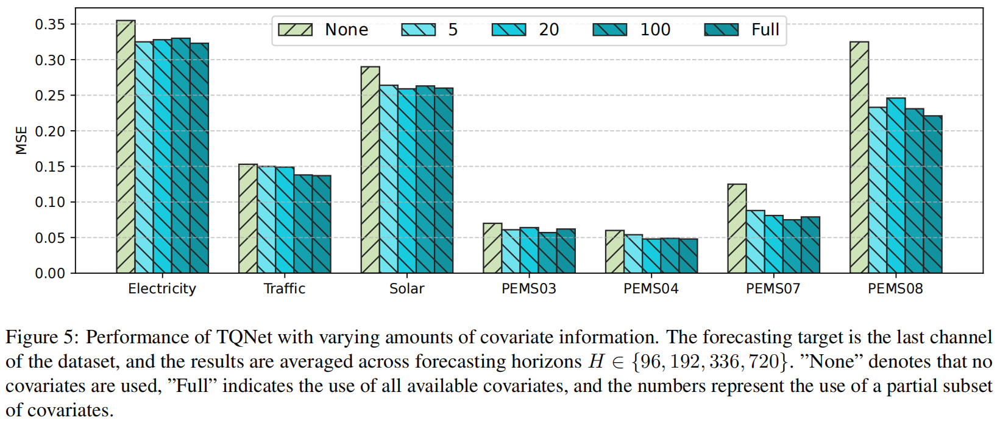
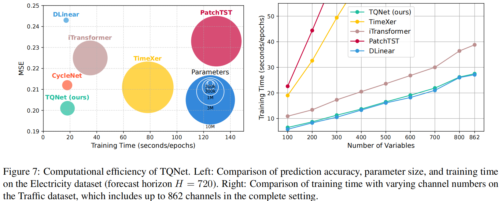

# TQNet

Welcome to the official repository of the TQNet paper: "[Temporal Query Network for Efficient Multivariate Time Series Forecasting](https://arxiv.org/pdf/2505.12917)". 

[[Poster|海报]](https://drive.google.com/file/d/1ZFuo8_lDzD104UuzxkHRmchuWUPN2x5F/view?usp=drive_link) - [[Slides|幻灯片]](https://drive.google.com/file/d/1cJVuZ1uLKSkLgbGJA_KZHVnehhlGx64S/view?usp=drive_link) - [[中文解读]](https://zhuanlan.zhihu.com/p/1908842630466471890)

## Updates
🚩 **News** (2025.05): TQNet has been accepted to ICML 2025 and the paper and code is currently available.

**Please note that** [**SparseTSF**](https://github.com/lss-1138/SparseTSF), [**CycleNet**](https://github.com/ACAT-SCUT/CycleNet), and [**TQNet**](https://github.com/ACAT-SCUT/TQNet) represent our continued exploration of **leveraging periodicity** for long-term time series forecasting (LTSF). 
The differences and connections among them are as follows:

|                            Model                             |        Use of Periodicity         |            Technique             |                   Effect                   |      Efficiency      |                   Strengths                   |                      Limitation                       |
| :----------------------------------------------------------: | :-------------------------------: | :------------------------------: | :----------------------------------------: | :------------------: | :-------------------------------------------: | :---------------------------------------------------: |
| [**SparseTSF**](https://github.com/lss-1138/SparseTSF)  <br> **(ICML 2024 Oral**) |    Indirectly via downsampling    | Cross-Period Sparse Forecasting  |             Ultra-light design             |   < 1k parameters    |       Extremely lightweight, near SOTA        | Fails to cover multi-periods **(solved by CycleNet)** |
| [**CycleNet**](https://github.com/ACAT-SCUT/CycleNet) <br> **(NeurIPS 2024 Spotlight)** | Explicit via learnable parameters | Residual Cycle Forecasting (RCF) |         Better use of periodicity          | 100k ~ 1M parameters |      Strong performance on periodic data      | Fails in multivariate modeling **(solved by TQNet)**  |
|                  [**TQNet**](https://github.com/ACAT-SCUT/TQNet) <br> **(ICML 2025)**                   |    Serve as global correlations     |   Temporal Query in attention mechanism  | Robust inter-variable correlation modeling |    ~1M parameters    | Enhanced multivariate forecasting performance |     Hard to scale to ultra-long look-back inputs      |


## Introduction

**TQNet** is the powerful successor to [**CycleNet**](https://github.com/ACAT-SCUT/CycleNet) (our previous work, **NeurIPS 2024 *Spotlight***). While CycleNet introduces the use of *learnable vectors* to model periodic patterns within individual variables, it fails to effectively capture **inter-variable dependencies**.

To bridge this gap, **TQNet** leverages the same *periodically shifted learnable vectors* from CycleNet as **queries** in an attention mechanism, allowing the model to capture **global inter-variable correlations**. Meanwhile, **keys** and **values** are derived from the raw input data to encode **local sample-level information**, thereby fusing **global priors** with **local observations**.



TQNet adopts a **single-layer attention mechanism** and a **lightweight MLP**, resulting in a compact and efficient model design.
Extensive experiments demonstrate that TQNet learns more **robust multivariate dependencies**, achieving **state-of-the-art forecasting accuracy** across **12 challenging real-world datasets**.



An ablation study on different Q-K configurations reveals that the **TQNet strategy**, which considers both **global** and **per-sample** correlations, consistently yields the best performance.
In contrast, variants that rely solely on either global or per-sample information lead to **suboptimal results**.



Further ablations highlight the **core contribution** of the proposed TQ technique.
In addition, **integration studies** confirm the **portability** and **effectiveness** of TQ in enhancing the forecasting capability of other existing models.



The figure below visualizes the t-SNE projections of the learned TQ vectors after training.
Strikingly, channels that are closer in the t-SNE space tend to share similar temporal patterns, while those farther apart exhibit distinct dynamics.
This indicates that the TQ technique effectively captures **intrinsic multivariate correlations**.



To further validate its effectiveness, we evaluate TQNet on a **multivariate-to-univariate** forecasting task—predicting one target variable using a varying number of input channels.
As shown in the figure below, incorporating even a moderate amount of covariate information significantly improves TQNet’s performance, highlighting its strength in modeling robust cross-variable dependencies.



Finally, thanks to its powerful **TQ technique** and **lightweight architecture**, TQNet delivers **exceptional forecasting accuracy** with **minimal computational overhead**.
Even when scaling to datasets with more variables, TQNet remains highly efficient, closely matching the speed of linear-based models like **DLinear**.




## Getting Started

### Environment Requirements

To get started, ensure you have Conda installed on your system and follow these steps to set up the environment:

```
conda create -n TQNet python=3.8
conda activate TQNet
pip install -r requirements.txt
```

### Data Preparation

All the datasets needed for TQNet can be obtained from the [[Google Drive]](https://drive.google.com/file/d/1bNbw1y8VYp-8pkRTqbjoW-TA-G8T0EQf/view) that introduced in previous works such as Autoformer and SCINet. 
Create a separate folder named ```./dataset``` and place all the CSV files in this directory. 
**Note**: Place the CSV files directly into this directory, such as "./dataset/ETTh1.csv"


### Training Scripts

The training scripts for replicating the TQNet results are available at:

```
./scripts/TQNet
```

### Quick Reproduction the Main Results

You can reproduce all the main results of TQNet with the following code snippet.

```
conda create -n TQNet python=3.8
conda activate TQNet
pip install -r requirements.txt
sh run_main.sh
```

For your convenience, we have provided the **execution results** of "sh run_main.sh":
```
./result.txt
```

### Reproduction the Ablation Results

You can also reproduce all the ablation results of TQNet and the other variants with the following script.
```
sh run_ablation.sh
```

## Citation
If you find this repo useful, please cite our paper.
```
@inproceedings{lin2025TQNet,
  title={Temporal Query Network for Efficient Multivariate Time Series Forecasting}, 
  author={Lin, Shengsheng and Chen, Haojun and Wu, Haijie and Qiu, Chunyun and Lin, Weiwei},
  booktitle={Forty-second International Conference on Machine Learning},
  year={2025}
}
```

## Acknowledgement

We extend our heartfelt appreciation to the following GitHub repositories for providing valuable code bases and datasets:

https://github.com/ACAT-SCUT/CycleNet

https://github.com/lss-1138/SparseTSF

https://github.com/thuml/iTransformer

https://github.com/lss-1138/SegRNN

https://github.com/yuqinie98/patchtst

https://github.com/cure-lab/LTSF-Linear

https://github.com/zhouhaoyi/Informer2020

https://github.com/thuml/Autoformer

https://github.com/MAZiqing/FEDformer

https://github.com/alipay/Pyraformer

https://github.com/ts-kim/RevIN

https://github.com/timeseriesAI/tsai

