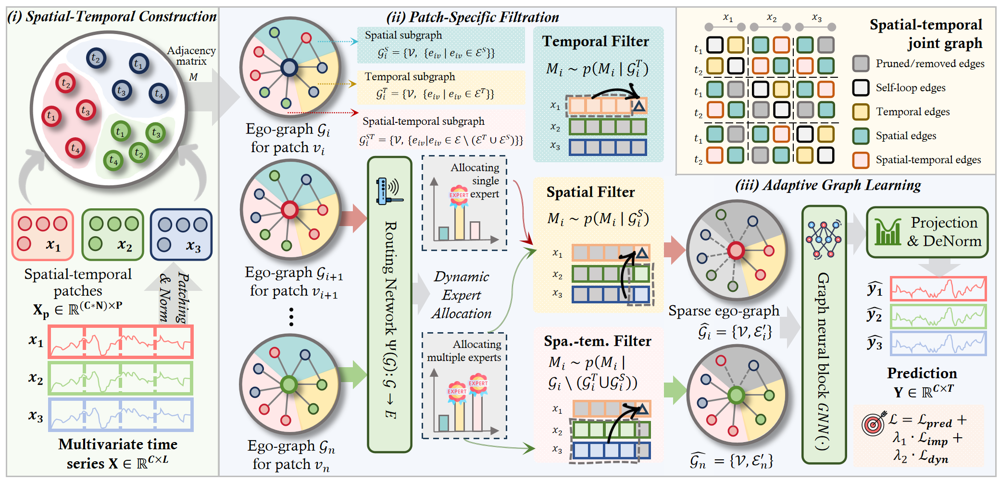

# TimeFilter: Patch-Specific Spatial-Temporal Graph Filtration for Time Series Forecasting


## 📰 News

🚩 2025-05-01: TimeFilter has been accepted as ICML 2025 Poster.

🚩 2025-01-22: Initial upload to arXiv [PDF](https://arxiv.org/pdf/2501.13041).

## 🌟 Overview

TimeFilter is a cutting-edge solution for time series forecasting, incorporating three main components: the **Spatial-Temporal Construction** Module, the **Patch-Specific Filtration** Module, and the **Adaptive Graph Learning** Module.



## 🛠 Prerequisites

Ensure you are using Python 3.10.16 and install the necessary dependencies by running:

```
pip install -r requirements.txt
```

## 📊 Prepare Datastes

Begin by downloading the required datasets. All datasets are conveniently available at [iTransformer](https://drive.google.com/file/d/1l51QsKvQPcqILT3DwfjCgx8Dsg2rpjot/view?usp=drive_link). Create a separate folder named `./data` and neatly organize all the csv files as shown below:
```
data
└── electricity.csv
└── ETTh1.csv
└── ETTh2.csv
└── ETTm1.csv
└── ETTm2.csv
└── traffic.csv
└── weather.csv
└── solar_AL.txt
└── PEMS03.npz
└── PEMS04.npz
└── PEMS07.npz
└── PEMS08.npz
```

## 💻 Training

All scripts are located in `./scripts`. For instance, to train a model using the ETTh1 dataset with an input length of 96, simply run:

```shell
bash ./scripts/ETTh1.sh
```

After training:

- Your trained model will be safely stored in `./checkpoints`.
- Numerical results in .npy format can be found in `./results`.
- A comprehensive summary of quantitative metrics is accessible in `./result_long_term_forecast.txt`.

## 📚 Citation
If you find this repo useful, please consider citing our paper as follows:
```bibtex
@inproceedings{
hu2025timefilter,
title={TimeFilter: Patch-Specific Spatial-Temporal Graph Filtration for Time Series Forecasting},
author={Yifan Hu and Guibin Zhang and Peiyuan Liu and Disen Lan and Naiqi Li and Dawei Cheng and Tao Dai and Shu-Tao Xia and Shirui Pan},
booktitle={Forty-second International Conference on Machine Learning},
year={2025},
url={https://openreview.net/forum?id=490VcNtjh7}
}
```

## 🙏 Acknowledgement
Special thanks to the following repositories for their invaluable code and datasets:

- [PatchTST](https://github.com/yuqinie98/PatchTST)
- [DUET](https://github.com/decisionintelligence/DUET)
- [TimeSeriesCCM](https://github.com/Graph-and-Geometric-Learning/TimeSeriesCCM)
- [Time-Series-Library](https://github.com/thuml/Time-Series-Library)
- [iTransformer](https://github.com/thuml/iTransformer)

## 📩 Contact
If you have any questions, please contact [huyf0122@gmail.com](huyf0122@gmail.com) or submit an issue.
