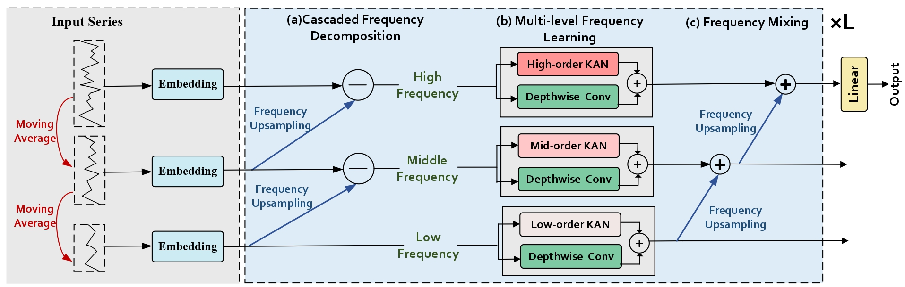
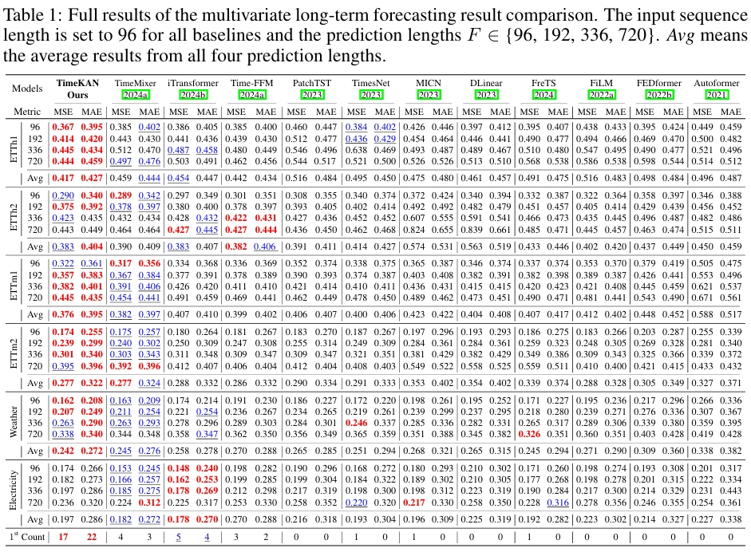

<div align="center">
  <h2><b> (ICLR 2025) TimeKAN: KAN-based Frequency Decomposition Learning Architecture for Long-term Time Series Forecasting🚀 </b></h2>
</div>

### This is an offical implementation of "TimeKAN: KAN-based Frequency Decomposition Learning Architecture for Long-term Time Series Forecasting" 

## Overall Architecture
<p align="center">

</p>


## Results
<p align="center">

</p>

## Getting Started
1. Install requirements. ```pip install -r requirements.txt```

2. Download data. You can download all the datasets from [Autoformer](https://drive.google.com/drive/folders/1ZOYpTUa82_jCcxIdTmyr0LXQfvaM9vIy). 

3. Training. All the scripts are in the directory ```.scripts```.  If you want to obtain the results of **input-96-predict-96** on the Weather dataset, you can run the following command:
```
sh scripts/long_term_forecast/Weather/weather_96.sh
```


## Acknowledgement

We sincerely appreciate the following github repo very much for the valuable code base and datasets:

https://github.com/cure-lab/LTSF-Linear

https://github.com/kwuking/TimeMixer

https://github.com/thuml/Time-Series-Library

https://github.com/ts-kim/RevIN

https://github.com/SynodicMonth/ChebyKAN


## Citation

If you find this repository useful for your work, please consider citing it as follows:

```BibTeX
@inproceedings{
  huang2025timekan,
  title={Time{KAN}: {KAN}-based Frequency Decomposition Learning Architecture for Long-term Time Series Forecasting},
  author={Songtao Huang and Zhen Zhao and Can Li and LEI BAI},
  booktitle={The Thirteenth International Conference on Learning Representations},
  year={2025},
  url={https://openreview.net/forum?id=wTLc79YNbh}
}
```
